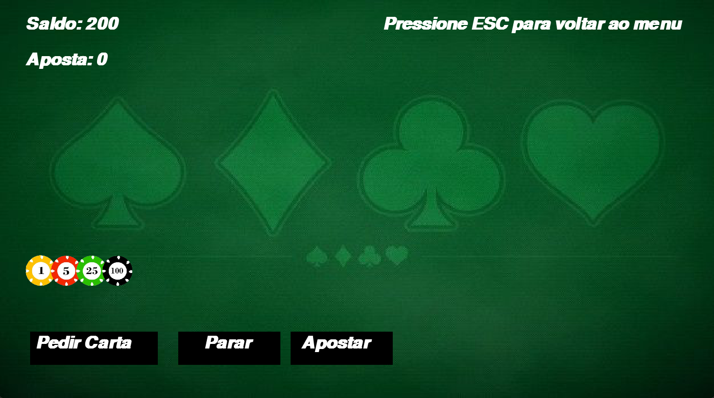

# 🃏 TigrinhoJack - Blackjack com Pygame

Bem-vindo ao **TigrinhoJack**, uma implementação do clássico jogo de Blackjack desenvolvida com a biblioteca **Pygame**. Este projeto combina a diversão do jogo com gráficos e sons envolventes, incluindo uma trilha sonora imersiva para aprimorar a experiência.

## 🎮 Sobre o Projeto

O **TigrinhoJack** foi criado para oferecer uma experiência divertida de Blackjack. Ele inclui:
- Um baralho completo de cartas estilizadas.
- Imagens de fichas para apostar.
- Trilha sonora para ambientação.
- Interface gráfica intuitiva com botões e tutoriais.

## 🧩 Funcionalidades

- **Menu Principal:** 
  - Iniciar o jogo.
  - Acessar um tutorial com as regras do Blackjack.
  - Sair do jogo.
- **Tutorial:** Explica as regras e dá dicas para os jogadores.
- **Jogo:** 
  - Aposte fichas com valores variados.
  - Peça cartas, pare ou reinicie o jogo.
  - Sistema de pontuação e lógica de vitória/derrota.

## 🚀 Como Rodar o Projeto

### Pré-requisitos
Certifique-se de ter o Python 3.8+ instalado e o Pygame configurado:

```bash
pip install pygame
```

> Nota: Certifique-se de que todas as imagens, fontes e trilhas sonoras estejam no diretório correto conforme especificado no código.

## 🖼️ Capturas de Tela
### Menu Principal


### Jogo em Andamento



## 📂 Estrutura do Projeto

```
blackmonkeyjack/
│
├── main.py                # Código principal do jogo
├── Fundo/                 # Imagens de fundo
├── Copas/                 # Cartas do naipe Copas
├── Espadas/               # Cartas do naipe Espadas
├── Ouros/                 # Cartas do naipe Ouros
├── Paus/                  # Cartas do naipe Paus
├── Fichas/                # Imagens das fichas de aposta
├── FontePixel/            # Fontes utilizadas no jogo
├── README.md              # Documentação do projeto
```

## ⚠️ Avisos
- Este projeto foi criado para fins educacionais e de entretenimento.  
- Jogue com responsabilidade e divirta-se!

## 💻 Tecnologias Utilizadas
- Python 3.8+
- Pygame

## 👤 Autor
- *** Bruno Henrique Benkendorf / Andre Luiz de Souza / Ian Bruno Lopes Bonmann ***  
  - [GitHub](https://github.com/BrunoBenkendorf)  
  - [LinkedIn](https://linkedin.com/in/Bruno Benkendorf)  

---

**TigrinhoJack**: porque a ganância move o homem, mas também o derrota. 😄
